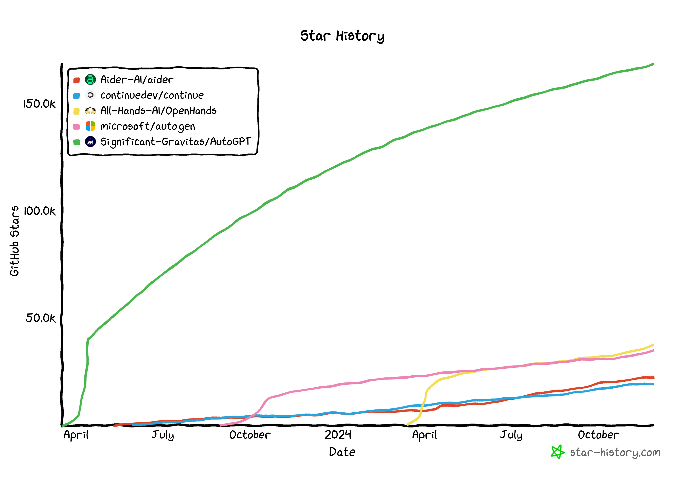

There are several themes that repeat often in startup literature. One of those themes is that picking a market is very important. Jason Cohen advises on picking a [large enough market](https://longform.asmartbear.com/problem/), Rob Walling says: “Market comes first, marketing second, aesthetic third, and functionality a distant fourth” and [VCs mention fast flowing waters](https://www.nfx.com/post/find-the-fast-moving-water). So, how do we actually find out which markets are large?

To make that statement actionable, we should define some metrics to measure:
1. number of customers in a market,
2. total amount of money in a market,
3. year on year growth in one of the above two.

What is big is a relative term - enterprise customers are much bigger spenders than customers of mobile apps. What numbers we use also depends on our goals - if we are trying to build a consultancy then current size is very important. If we are trying to build the biggest company in the world, we probably need to bet on future growth.

This [HubSpot article](https://blog.hubspot.com/marketing/market-size) talks about estimating market sizes in terms of customers. In this post the focus is more on leveraging publicly available data to make reasonable guesses on which places are high-growth.
### What is a market?

A market is a collection of similar buyers. For example - every knowledge worker is a target customer of OpenAI's ChatGPT, and every company that has its own R&D is a potential customer of GitHub's Copilot.

If you are a solo founder like me, going into a large market can be useful. While all the other big players are targeting and competing for a big slice of the market, we can niche down to a very specific and underserved slice of it.

### Data sources: finding companies

##### Product reviews

[Capterra](capterra.com) and [G2](https://www.g2.com/) have reviews of companies in different industries and is good for finding the biggest players in a category.
##### Investors

[YCombinator]() and [Sequoia Capital](https://www.sequoiacap.com/our-companies/?_stage_current=seed#all-panel) publicly show which companies they have funded.

##### Product launch webistes

[ProductHunt](https://producthunt.com) is a place where new companies announce themselves, it also has proxy metrics on how big the launch was.

### Data sources: finding sizes

##### Industries overall

For finding out generic answers, there are many groups publishing research reports. Depending on what we search for, data varies and it's not clear-cut how to estimate different industry sizes.

Some examples:  
- for reports around industries: [ourworldindata.org](https://ourworldindata.org/), [statista.com](https://statista.com),
- for estimations on numbers that are hard to get: [futuresearch.ai](https://futuresearch.ai/),
- for quick overviews of biggest players: [fortune.com](https://fortune.com/ranking/global500/), [companiesmarketcap.com](https://companiesmarketcap.com),
- for financial data: [finviz.com](https://finviz.com), [macrotrends.net](https://www.macrotrends.net).
- govornment statistics: U.S. Bureau of Economic Analysis, Hoovers
##### Private companies

For non-public companies, it might take effort to dig through the noise - for example everybody has estimates and comments on OpenAI numbers, but the proper finances are probably hidden. Depending on our needs (e.g. earning money on stocks), we might want to dig and triangulate numbers in private companies such as [here](https://www.tanayj.com/p/openai-and-anthropic-revenue-breakdown). If we just want to learn what the big markets currently are, we can take the total company evaluations (from e.g. [Crunchbase](https://crunchbase.com)) as the single datapoint on those companies.
Other similar aggregators of data are [PitchBook](https://pitchbook.com/) and [AngelList](https://www.angellist.com/), although none of them are free sources.
##### Public companies

Public companies are easies than private ones:
- stock prices to see general sentiment over companies,
- public earnings reports - with revenue and profit information (I found that annual reports have good enough details).

These are usually posed on company websites and can be found through a simple search.

##### Companies with open source code

Number of forks or number of stars on GitHub.

### Estimating some markets

**Project management software**
- Monday: +60.41% past year, $13.92B market cap
- Asana: -26.13% past year, $3.53B market cap
- ClickUp: $537.5M total in funding, $3.6B valuation 2021 
- SmartSheet: +34.36% past year, $7.83B market cap

**Hardware**
- Taiwan Semiconductor: +86.39% past year, $811.79B market cap, $69B revenue 2023 and $26B net income 2023
- Nvidia: +180.56% past year, $3.44T market cap, $26.9B revenue 2023 and $4.2B operating income 2023

**AI agents and coding tools.**

**Email marketing**
- Apollo.io: series D $100M at $1.6B in 2023
- Intuit Mailchimp $12B exit in 2021
	- Intuit +13.35% past year, $178.51B market cap, $14.3B revenue 2023
- Constant Contact $1.1B exit in 2015
- Brevo: $197M total funding, last round $160B in 2020
- Userlist: unknown amount TinySeed preseed round in 2020

### Conclusions from a small sample

We can see that the AI boom is represented well in this data - hardware companies have crazy big growth, AI coding tools have big growth, project management software is having solid increases, while email marketing is not growing that fast.
