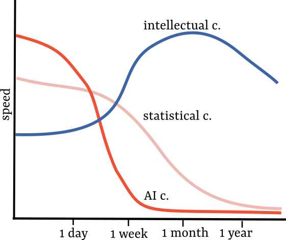

# Intellectual control and theory building
If you're trying to figure out how to think about software development in light of new LLM powered tools and IDEs, then this might be for you. I present several things I learned from George Fairbanks around software design, connect them to AI powered development and vibe-coding, and at the end show concrete tips that fall out of the theories. I heard about these ideas while I was at Google, where Fairbanks is one of the organizers of software architecture classes.

I draw lessons from my personal experience in development and the lessons I learned which are all linked. I have around 5 years of professional experience as a software engineer, and I'm a big fan of reading about software architecture. Whenever I tried to use AI to write code, I remembered the idea of Fairbanks around control, and I haven't seen anybody else make the connection until now. The ideas here are quite abstract, so things might get fuzzy. I would love to include more concrete cases, so if you want to chat about them or share them, please contact me!

For a piece of software, it could be a whole program or a function, we have **intellectual control** [^FairbanksIC] when we know how the program/function works. Examples of things we can do when we have intellectual control are: 
- we can predict the outputs for a given set of inputs,
- we can explain the code to somebody else,
- we roughly know how much work would a specific requirement or change be.
Since our brains are limited, we probably don't have the model of the whole codebase in our heads (complexity undermines understanding [^hickeysimple]). In different words, we have more intellectual control over some parts of the codebase, and less intellectual control over other parts.

Here is a trivial example with two functions:
```
def make_them_laugh(people, joke):

def make_them_laugh(people: List[Person], joke: str) -> bool:
```
Just from the type signature, we know more about the function! We don't need to go inside the implementation to learn what kind of objects does ```make_them_laugh``` accept. Intellectual control here is the knowledge about the function behavior. The function type lets us access the knowledge faster - and as our codebase grows, accessibility matters a lot.

In the above case, we might even infer that the return variable means some kind of success. To signify that, we could wrap the return variable into some kind of Enum or Class:
```
def make_them_laugh(people: List[Person], joke: str) -> AudienceResult:
```

This brings us to the idea of **programming as theory building**[^naurtheory]. Our code is a representation of our thoughts, it is a representation of our model of reality. As Fairbanks presents[^fairbankspartner], it is also a helper in how we think. The ```AudienceResult``` type might not bring any benefits regarding code execution or functionality, but it is beneficial to our understanding of what happens when we ```make_them_laugh```. Between the code and what we think, there is a back-and-forth relationship. Similarly to how writing lets us think of ideas that we haven't even considered before, it helps us think more complicated thoughts.

In his talk, Simple Made Easy [^hickeysimple], Rich Hickey echoes the same: we can change our program without fear only if we understand it.  

Obviously, neither is our model of reality a perfect model, and neither does code perfectly respond to what we think. The discrepancy between the code and our thoughts, Fairbanks calls **ur-tech debt**.  This tech debt occurs when the model of the world that we have in our head is different from the way that our software models the world. The world changes regardless of what we think about it, while the code stays the same if we don't invest the effort.

Here are two examples of how the world changed and created ur-tech debt:
- in this Startups for the Rest of Us episode, Savvycal founder Derrick Rymer talks how supporting a completely new use-case would force the software to change, around the XXmin mark  

Derrick Rymer talks about a moment where they could potentially change what their software models:

> A very small percentage of our customers use SavvyCal for a lot of internal scheduling, which theoretically is a pretty powerful way to use it. (...) So I dug into it a little bit, and asked \[the customer\] some more questions, and discovered that he was basically using \[SavvyCal functionality\] as a way to use round robin, and put time on one of their internal team members’ calendars. (...) And this was just causing all kinds of problems with our ability to stay in sync with that calendar event. I thought for a second, “We need to solve some of these problems, and maybe add a setting to allow it to be editable,” but then realized, for anyone who’s doing the traditional path of sending a link, scheduling, something with an external party, you would never want it to be fully editable by all parties.

- when the Digital Markets Act arrived, people at Google, including the team I was in, had to rework their software to comply with the regulations.

In the first case their understanding of the world and the requirements evolved. Their choice was whether to support the new use-case and update the software to better suit that customer segment.  

In the second case the requirements changed. Google decided to support the new requirements because the alternatives (leaving EU market or paying fines) weren't good for business.

We can think of the above two examples as control "in the large". Our model of the world changes, so we need to modify our model of the solution. Where the code will change and how can we reuse the facillities we already have are examples of intellectual control on a larger scale. Opposing to that would be control "in the small" - with an example being function types from the start. Other in the small control example could be around naming, function structure, folder organization, decisions around libraries and so on. 

# Statistical control

Fairbanks contrasts intellectual control with **statistical control**. Statistical control is when we rely on tests to tell us whether something works. Tests serve as our guardrails, and ensure that we don't ship a disaster to our customers. When you have intellectual control, tests serve as a confirmation that the theory captured by code is correct. When you don't have a theory, tests only confirm that the specific inputs result in correct outputs.

As good engineers or people with zero code, we will start with both intellectual control and statistical control. Fairbanks talks about the problem when statistical control is all we have left - there is no theory that the program follows anymore.  When you only have statistical control, you can only do 'whack-a-mole' development - the ultimate form of Test Driven Development. You want to make a change, write a test wherever it fits and fix the code so the test passes. Maybe you break another test, fix that, and then rinse and repeat until you make your testing suite happy.

This style of development results in tech-debt piling on. Since you don't know what is happening (i.e. don't have intellectual control), each new change has its own logic, its own narrative. Soon, there are dependencies where there shouldn't be any, and you're left with a big ball of mud. A person modifying the code afterwards (might be you!) won't be able to tell why is a certain piece is done the way it is, and will need to rediscover the logic. As the ball of mud grows, our development speed slowly but surely starts decreasing.

When intellectual control is lost, rebuilding the theory is costly.
# AI control

On the wings of a certain CEO saying that programming as a discipline will die out [^jensennobody], a lot of people have been talking about **vibe-coding**. For my purposes, I will define vibe-coding as programming using LLMs without knowing what code is being written. Let's call our ability to edit code through an LLM interface as **AI control**. By that definition, vibe-coding would be deciding to only rely on AI control for development, and forsaking intellectual control from the start. Again, to regain that intellectual control and understand what is happening inside the code, a lot of work is required.

Many people have written about why vibe-coding is not good enough for proper software development. Anecdotally from internet comments, many people mention that their development speeds slows down to a crawl at some moment, with the LLM tool not being able to modify the code anymore - the AI control being lost. This reflects my experience as well.

Here is a funny description by Reed Harper[^reedworkflow]:

> When I describe this process to people I say “you have to aggressively keep track of what’s going on because you can easily get ahead of yourself." (...) For some reason I say “over my skis” a lot when talking about LLMs. I don’t know why. It resonates with me. Maybe it’s because it is beautiful smooth powder skiing, and then all of a sudden you are like “WHAT THE FUCK IS GOING ON!,” and are completely lost and suddenly fall off a cliff.

<figure>
  
  <figcaption>Engineering speed in relation to how old the project is. Intellectual control is the slowest initially, but doesn't end up in a state bogged down by accumulated complexity.</figcaption>
</figure>

To understand AI control more, let's consider a fundamental difference with the two other forms of control: we don't write the code. Not writing code is not a new situation. There are several very common ways where we use code other people wrote: operating system, programming language, libraries, APIs, and finally outsourcing. With the exception of outsourcing, we usually trust and rely on programs written by others. Most code that we use is relied on by many people, and wouldn't come towards us if it wasn't tested and trustable.

On the other hand, outsourcing - or the eager junior metaphor - feel more similar in how we regard this foreign code. The difference is that it's bespoke for our usecase. The quality bar for usability is much lower by default. It's an external piece that should be carefully managed, and if done correctly, it can bring benefits. It is also a famous source of disagreements and bad written code.

Here is XX the founder of GreenPal, talking about outsourcing: "And and first, he doesn't know what a lawn is, like he, he has never seen grass, he doesn't, he's never heard of a lawnmower and he doesn't know what a lawn is. And I'm like, I'm like damn man, like this dude. This dude is probably a really good engineer, but he has no, he has no context to understand what it is we're trying to actually solve in the world here." They ended up building the product themselves.

Joel Spolsky has a lovely essay [^spolskynih] on when you should build something in-house, vs when you can use an external solution. One extreme considered is the 'Not invented here' syndrome where the team is reluctant to use any piece of code that they haven't developed (such a team probably values intellectual control to unhealthy degrees). Spolsky argues for the following heuristic: it's ok to outsource unless the thing outsourced is your core business proposition. From a market competition standpoint, the things that give you edge should be tightly controled, hence developed in-house. 

If we let AI control all of our coding, some decisions will be made for us, and we won't have a choice in what our velocity over time trajectory looks like. Every decision that the AI makes for us, we cannot backtrack on - because we are not aware of what is happening. Even if we assume that AI control is good enough for our use-cases, for every decision AI makes for us, we lose some edge that we could have made by choosing slightly differently. Hence, you want intellectual control over business critical parts - it needs to properly reflect your learnings and your model of reality, you want to squeeze every edge possible. The bigger the part you decide to 'outsource to AI', to bigger the possible discrepancy of your knowledge compared to what is inside the software.

There is a correspondence - simple and theory building - contrasted with easy and vibe coding, where one results in fast speed over longer periods, and the other in fast initial speed. Hickey says that the fastest you can go is if you go on short tracks[^hickeysimple], but that doesn't describe why the graphs look like they do, it just forms an analogy. This is because we need to invest additional effort to make sure our code can be worked on in the future, which happens less if we invest all our effort in delivering something fast. Ensuring intellectual control is one way in which we invest in the future.

In the end, AI wasn't trained on matching code and reality. It doesn't know in which context some code was made. That training data doesn't exist. So it sounds like folly to rely on AI and think that the code will be automatically good - we might end slowed down, or have code that is exactly like what the other 10 companies have.
# Practical considerations

1. It's easier to keep intellectual control, than to regain it.

During development, try to be aware of how well the code matches your understanding. Our understanding is never perfect, and the code suboptimally matches our understanding, but being aware at the moment of making a deliberate choice **and documenting it** is much easier than understanding why something was done in a specific way. One convenient way of doing this is through Architecture Decision Records[^nygardadr] which can live in the codebase where they are relevant.

When you're using AI tools to speed up development, try to **limit the blast radius**. This is also why some AI tools recommend making step-by-step changes [^aidertips] - all with the goal of not falling off of your skis. If the functionality is wrapped in a well designed contract and tested well, then the possible lack of knowledge is well-contained within the boundaries of that contract. You might even have no idea how it's implemented, but know how to handle that piece of functionality. Fairbanks made a nice course on design by contract. [^fairbankscontract]

Here is a lightly edited example from something I worked on:

```
def get_outline_from_pixels(input_pixels: List[ImagePixel]) -> List[PixelVertex]:
    """
    Returns the vertices of pixels that form the outer outline of the input
    set of pixels.
    
    The first and last element are vertices of the same pixel.
    On inputs where the set of pixels is not a connected component, it will
    return the outline of the leftmost connected component of pixels.
    """
    # implementation
```

First, even if you don't know how this method ends up being implemented, the inputs and outputs form a contract which you can reason about. The contract tells you what you need to know to have a model of this single function.

Second, this can serve as good context for prompting an LLM, as can the ADRs mentioned above. If we think that intellectual control is something we want from a system, then creating tools that work with our model should be a goal of AI tooling, but also of our programming activities - if we don't create good artefacts that capture our model well, then we cannot put anything as context into the AI. 

In the long run, be careful of having places with a large lack of intellectual control - it leads to quick creation of tech debt and a slowdown to development speed. The bigger scope of your project - in engineers working on it, people using it, computation done, the more relevant intellectual control is. If you produce a lot of code with AI where you don't know exactly what it does, treat it as carefully as it deserves, in order to not poison your whole system.

2. Be aware when intellectual control is not your biggest priority.

A rough heuristic could be: the effort invested into a piece of software should be proportional to the number of times it is run.

Maybe you're at an early startup in the explore phase, [^cohenexplore] where the goal is to fix every misunderstanding as fast as possible, and the product (or better, the idea of the product) changes every day. Maybe you're rapidly gaining knowledge on customers. There, it probably doesn't make sense to invest time in well-designed code. It would be a form of **premature optimization**, where you're optimizing value (theory building) for a particular model of reality, but if that reality changes tomorrow, the work can be thrown away. The work of theory building in software is downstream of your model of the business.

This could be exemplified by the concept of **two-way doors**. If you need to make a decision, and that decision is reversible, the best course is to just produce the code that would test out that hypothesis [^chinaction]. If your code is written well, if you understand why code looks the way it looks like (for example through ADRs), you can come back and decide differently.

Ward Cunningham says [^cunninghamdebt]: 

> Rushing software out of the door to get some experience was a good idea - borrowing money is a good idea. (...) but as you learn you would later go back to repay the loan (...) people have confused it with the idea of writing code poorly with the intention of getting back to it later.

Differently, if you expect that your model will change rapidly, then it might be a good trade-off to let AI handle the complete development - if the scope of software you want to write is small enough for your velocity to not drop, you might be able to forsake control in return for a temporary gain in speed (until you're crushed under the tech debt created).

Not every company is like Google, where there is for example a well-defined code review process and a readability process. Everybody teaches that code will be read many more times than it will be written, so maintainability is key. Google has a different top-of-mind than a startup - the incremental value of new code is low compared to a possible reputational risk, so the policies around code are generally enforced, even in places when they're not brining much value (e.g. teams that are starting out without a very clear mandate).

If something is not your core software, as is often the case of an internal tool or a data result, AI is great for speeding it up. Fire away! Later if you see that it's used more than initially expected, you can invest more effort in it.

[^FairbanksIC]: [George Fairbanks: Intellectual Control](https://ieeexplore.ieee.org/document/8611447) (also [conference talk]([talk](https://www.youtube.com/watch?v=Zs5UJqgu0tY)))
[^FairbanksPartner]: [George Fairbanks: Code Is Your Partner in Thought](https://www.computer.org/csdl/magazine/so/2020/05/09173629/1mts6mVaxDa) (also [conference talk](https://www.youtube.com/watch?v=Eczq1ZplFGE))
[^FairbanksValue]: [George Fairbanks: Building Theories is Building Value](https://www.youtube.com/watch?v=KCrmquf9nPw)
[^FairbanksContract]: [George Fairbanks: Contract-based Design](https://www.youtube.com/playlist?list=PLRqKmfi2Jh3sd0K7bWHzgwOcee65Musgz)
[^HickeySimple]: [Rich Hickey: Simple Made Easy](https://github.com/matthiasn/talk-transcripts/blob/master/Hickey_Rich/SimpleMadeEasy.md)
[^NaurTheory]: [Peter Naur: Programming As Theory Building](https://pages.cs.wisc.edu/~remzi/Naur.pdf)
[^CunninghamDebt]: [Ward Cunningham: Debt Metaphor](https://www.youtube.com/watch?v=pqeJFYwnkjE)
[^JensenNobody]: [Jensen Huang: "It is our job to create computer technologies such that nobody has to program."](https://www.youtube.com/watch?v=8Pm2xEViNIo&t=1139s)
[^AiderTips]: https://aider.chat/docs/usage/tips.html
[^ReedWorkflow]: [Harper Reed: My LLM codegen workflow atm](https://harper.blog/2025/02/16/my-llm-codegen-workflow-atm/)
[^ChinAction]: [Cedric Chin: Action Produces Information](https://commoncog.com/action-produces-information/)
[^CohenExplore]: [Jason Cohen: Explore vs Execute](https://longform.asmartbear.com/explore-execute/)
[^SpolskyNih]: [Joel Spolsky: In Defense of Not-Invented-Here Syndrome](https://www.joelonsoftware.com/2001/10/14/in-defense-of-not-invented-here-syndrome/)
[^NygardAdr]: [Michael Nygard: Documenting Architecture Decisions](https://cognitect.com/blog/2011/11/15/documenting-architecture-decisions)
[^ReimerStartups]: https://www.startupsfortherestofus.com/episodes/episode-622-making-hard-product-decisions-growth-vs-profitability-with-derrick-reimer
[^BryanClaytonOutsourcing]: https://devjourney.info/Guests/292-BryanClayton.html